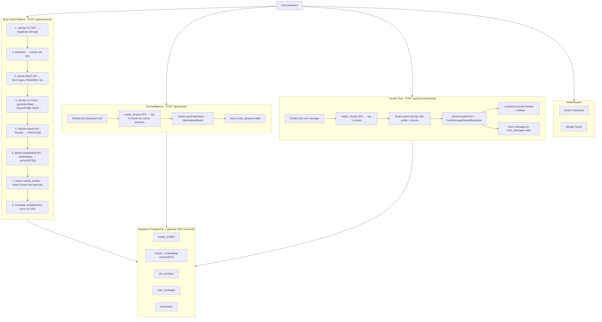

# CareerBrain

**AI-powered career intelligence platform.** Upload your CV and GitHub profile, let the system build a structured knowledge base of your career, then use it to analyse job fit and chat with an advisor that actually knows your history — not generic advice.

Built by [Hissan Butt](https://my-portfolio-vert-ten-39.vercel.app/) · [GitHub](https://github.com/Hissan-2002) · [LinkedIn](https://www.linkedin.com/in/hissan-butt/)

---

## What It Does

Most AI career tools give the same advice to everyone. CareerBrain is different — it grounds every single response in **your actual career data**, retrieved in real time from a vector database using RAG (Retrieval-Augmented Generation).

**Three core features:**

1. **Brain Builder** — Ingests your CV (PDF) and GitHub profile. Uses an LLM to extract a structured `CareerProfile` JSON object, chunks the raw text into sections, embeds everything into pgvector, and stores it as your personal knowledge base.

2. **Job Intelligence** — Paste any job description. The system embeds it, retrieves the most semantically relevant chunks from your profile, and runs a structured AI analysis that returns: a fit score (0–100), a decision (Strong Match / Partial Match / Not Ready), missing skills, a career gap summary, and 3 concrete project recommendations to close the gaps. Every result shows the exact profile chunks used.

3. **Career Agent Chat** — A streaming chat interface backed by RAG. Every message embeds your question, retrieves the top 5 relevant career chunks, injects them into the system prompt, and streams a grounded response. A sidebar shows exactly which parts of your profile informed each answer.

The defining design principle is **Visible RAG** — every AI output shows its sources. No black box.

---

## Architecture



---

## Full Technical Pipeline

### 1. Brain Build (`POST /api/brain/build`)

This is the core data ingestion pipeline. It transforms unstructured career documents into a queryable vector knowledge base.

**Step-by-step:**

| Step | What happens |
|---|---|
| 1 | The CV PDF is uploaded to **Supabase Storage** under `cvs/{userId}/{filename}` |
| 2 | The server downloads the file buffer and passes it to **pdf-parse** to extract plain text |
| 3 | If a GitHub username is provided, the **GitHub REST API** fetches: user bio, up to 10 non-forked repos (name, description, language, topics, stars), and the first 600 chars of each repo's README |
| 4 | CV text + GitHub text are combined into one raw text block |
| 5 | **Gemini 2.5 Flash** (`generateObject` with Zod schema) extracts a structured `CareerProfile` JSON: skills (with category + level), experience, projects, education, career level, primary direction, strengths, and skill category scores (0–100) for frontend/backend/AI/data/devops |
| 6 | The raw text is split into sections using a **section-based chunker** — it identifies headers (Experience, Skills, Projects, etc.) and splits on double newlines. Each chunk carries its section label as metadata. Min chunk size: 50 chars |
| 7 | All chunks are embedded in parallel using **gemini-embedding-001** (3072-dim vectors) via `embedMany()` |
| 8 | Old chunks for this user are deleted, new chunks + embeddings are batch-inserted into the `chunks` table (pgvector) |
| 9 | A **completeness score** (0–100) is calculated based on how many profile fields are populated |
| 10 | `career_profiles` is upserted with the structured JSON and completeness score |

---

### 2. Job Analysis (`POST /api/analyze`)

A RAG pipeline that answers "how well do I fit this job?" using the user's actual career data.

**Step-by-step:**

| Step | What happens |
|---|---|
| 1 | The user's `CareerProfile` is fetched from `career_profiles` |
| 2 | The job description text is embedded using `gemini-embedding-001` |
| 3 | A **pgvector cosine similarity search** (`match_chunks` RPC) retrieves the top 8 most relevant career chunks |
| 4 | The career profile JSON + retrieved chunks + job text are assembled into a prompt |
| 5 | **Gemini 2.5 Flash** (`generateObject` with Zod schema) returns a structured `JobAnalysisResult`: fit score, decision, missing skills, gap summary, 3 project recommendations, reasoning |
| 6 | The result is saved to `job_analyses` with the retrieved chunk IDs |
| 7 | The full result + retrieved chunks are returned to the client for display |

The retrieved chunks and full analysis are displayed side-by-side in the UI — the user can see exactly which parts of their profile led to each conclusion.

---

### 3. Career Chat (`POST /api/chat`)

A streaming RAG chat that gives grounded, profile-specific career advice.

**Step-by-step:**

| Step | What happens |
|---|---|
| 1 | The client sends the full message history as `UIMessage[]` |
| 2 | The last user message is embedded using `gemini-embedding-001` |
| 3 | `match_chunks` RPC retrieves the top 5 most relevant career chunks |
| 4 | The career profile + chunks are injected into a system prompt |
| 5 | **Gemini 2.5 Flash** (`streamText`) streams the response back using `toUIMessageStreamResponse()` |
| 6 | The retrieved chunk IDs are sent back in the `x-retrieved-chunks` response header |
| 7 | The client captures this header via a custom `fetch` wrapper, fetches the chunk content from `/api/chat/chunks`, and updates the sidebar |
| 8 | On stream completion, the assistant message + chunk IDs are saved to `chat_messages` |

The right sidebar updates after each response, showing exactly which career sections were retrieved to generate the answer.

---

## Tech Stack

| Layer | Technology | Why |
|---|---|---|
| Framework | Next.js 16 (App Router, TypeScript strict) | Server components, API routes, streaming |
| Styling | TailwindCSS v4 + shadcn/ui | Dark design system, utility-first |
| Auth | Supabase Auth (email + Google OAuth) | Session management, SSR cookies |
| Database | Supabase PostgreSQL | Structured + vector storage in one place |
| Vector store | pgvector extension | Cosine similarity search on 3072-dim embeddings |
| File storage | Supabase Storage | CV PDF uploads |
| LLM | Google Gemini 2.5 Flash | Fast, capable, structured output via `generateObject` |
| Embeddings | Google `gemini-embedding-001` (3072 dims) | High-quality semantic search |
| AI SDK | Vercel AI SDK v6 (`ai`, `@ai-sdk/react`) | Streaming, structured output, React hooks |
| PDF parsing | `pdf-parse` v1.1.1 | Text extraction from CV PDFs |
| Charts | `recharts` | Skill radar chart on dashboard |
| Schema validation | `zod` | Validates all LLM outputs before saving |
| Markdown rendering | `react-markdown` | Formats AI chat responses |

---

## Project Structure

```
src/
├── app/
│   ├── (auth)/              # Login + signup pages
│   ├── (app)/               # Protected app pages
│   │   ├── dashboard/       # Stats cards + skill radar + recent analyses
│   │   ├── profile/         # Brain builder + profile view
│   │   ├── analyze/         # Job analysis form + results
│   │   ├── analyze/[id]/    # Individual analysis detail page
│   │   ├── chat/            # Career chat interface
│   │   └── history/         # All past analyses
│   ├── api/
│   │   ├── brain/build/     # Core ingestion pipeline
│   │   ├── brain/status/    # Pipeline status check
│   │   ├── analyze/         # Job analysis RAG pipeline
│   │   ├── chat/            # Streaming chat RAG
│   │   ├── chat/chunks/     # Fetch chunk content by IDs
│   │   └── github/          # GitHub profile fetcher
│   ├── page.tsx             # Landing page
│   └── globals.css          # Design system CSS variables
├── components/
│   ├── brain/               # BrainBuilder, PipelineProgress, ProfileCard
│   ├── analyze/             # JobForm, FitScoreMeter, GapAnalysis, SourceChunks
│   ├── chat/                # ChatInterface, ChatMessage, ChunkSidebar
│   ├── dashboard/           # StatsCards, SkillRadar
│   └── layout/              # Sidebar (desktop + mobile)
├── lib/
│   ├── ai/                  # gemini.ts, embed.ts, chunk.ts, parse-career.ts, analyze-job.ts
│   ├── supabase/            # client.ts, server.ts, middleware.ts
│   ├── github.ts            # GitHub REST API helper
│   ├── pdf.ts               # pdf-parse wrapper
│   └── types.ts             # All shared TypeScript interfaces
supabase/
└── schema.sql               # Full DB schema + RLS + match_chunks function
```

---

## Database Schema

```sql
-- career_profiles: one row per user, stores structured career JSON
-- chunks: vector embeddings of career text sections (3072 dims)
-- job_analyses: history of all job fit analyses
-- chat_messages: chat history with retrieved chunk IDs
-- match_chunks(): pgvector cosine similarity search function
```

See [`supabase/schema.sql`](supabase/schema.sql) for the full schema with RLS policies.

---

## Setup & Local Development

### 1. Clone and install

```bash
git clone https://github.com/Hissan-2002/CareerBrain.git
cd CareerBrain
npm install
```

### 2. Environment variables

Create `.env.local`:

```env
NEXT_PUBLIC_SUPABASE_URL=https://your-project.supabase.co
NEXT_PUBLIC_SUPABASE_ANON_KEY=your_anon_key
SUPABASE_SERVICE_ROLE_KEY=your_service_role_key
GOOGLE_GENERATIVE_AI_API_KEY=your_google_ai_studio_key
NEXT_PUBLIC_APP_URL=http://localhost:3000
```

Get your Google AI API key free at [aistudio.google.com/apikey](https://aistudio.google.com/apikey).

### 3. Supabase setup

- Run `supabase/schema.sql` in your Supabase SQL editor
- Enable Google OAuth: **Authentication → Providers → Google**
- Create a private storage bucket named `cvs`
- Set **Site URL** to `http://localhost:3000` under **Authentication → URL Configuration**

### 4. Run

```bash
npm run dev
```

Open [http://localhost:3000](http://localhost:3000).

---

## Deployment (Vercel)

1. Push to GitHub
2. Import repo on [vercel.com](https://vercel.com)
3. Add all 5 environment variables (set `NEXT_PUBLIC_APP_URL` to your Vercel URL)
4. Deploy
5. Add your Vercel URL to Supabase redirect URLs and Google OAuth authorized URIs

---

## Key Design Decisions

### Visible RAG
Every AI output shows the exact career profile chunks retrieved to generate it. Users can audit why they got a particular score or advice. This is not a bolt-on — it's architected into every feature from the API response headers to the sidebar UI.

### Single vector store, no third-party service
Embeddings live in the same Supabase PostgreSQL database as all other data, using the pgvector extension. No Pinecone, no Weaviate — simpler stack, one less service to manage.

### `generateObject` over raw JSON prompting
All structured AI outputs use Vercel AI SDK's `generateObject` with Zod schemas. The SDK handles JSON extraction, validation, and retries internally — no manual parsing, no truncation bugs.

### Section-based chunking
Text is chunked by semantic sections (Experience, Skills, Projects, etc.) rather than fixed character counts. This preserves context and makes retrieved chunks meaningful to users when shown as sources.

---

## Phase Breakdown

| Phase | What was built |
|---|---|
| 1 | Next.js scaffold, Supabase auth (email + Google), landing page, app shell with sidebar |
| 2 | Data pipeline: PDF parsing, GitHub API, Gemini extraction, pgvector embeddings |
| 3 | Job Intelligence: RAG analysis, fit score, gap analysis, project recommendations, source chunks |
| 4 | Career Chat: streaming RAG, useChat hook, chunk sidebar, message persistence |
| 5 | Dashboard: skill radar chart, stats cards, recent analyses, README |
