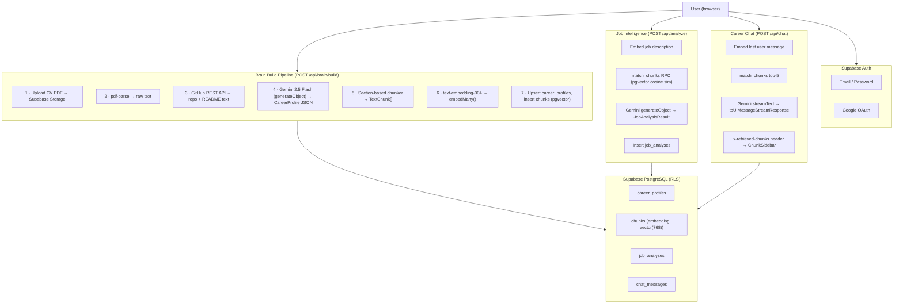

# CareerBrain

> AI-powered career intelligence — ingest your CV and GitHub profile, extract structured career data, and use RAG to analyse job fit and chat with your career history.

---

## Architecture



---

## Tech Stack

| Layer | Technology |
|---|---|
| Framework | Next.js 16 (App Router, TypeScript strict) |
| Styling | TailwindCSS v4 + shadcn/ui |
| Auth | Supabase Auth (email + Google OAuth) |
| Database | Supabase PostgreSQL + pgvector |
| Storage | Supabase Storage (CV PDFs) |
| LLM | Google Gemini 2.5 Flash (`@ai-sdk/google`) |
| Embeddings | Google `gemini-embedding-001` (3072 dims) |
| AI SDK | Vercel AI SDK v6 (`ai`, `@ai-sdk/react`) |
| PDF parsing | `pdf-parse` |
| Charts | `recharts` |
| Schema validation | `zod` |

---

## Setup

### 1 · Clone and install

```bash
git clone https://github.com/your-username/careerbrain.git
cd careerbrain
npm install
```

### 2 · Environment variables

Create `.env.local` in the project root:

```env
NEXT_PUBLIC_SUPABASE_URL=https://your-project.supabase.co
NEXT_PUBLIC_SUPABASE_ANON_KEY=your_supabase_anon_key
SUPABASE_SERVICE_ROLE_KEY=your_supabase_service_role_key
GOOGLE_GENERATIVE_AI_API_KEY=your_google_ai_api_key
```

### 3 · Supabase schema

Run the following SQL in your Supabase SQL editor:

```sql
-- Enable pgvector
create extension if not exists vector;

-- Career profiles
create table career_profiles (
  id uuid primary key default gen_random_uuid(),
  user_id uuid references auth.users not null unique,
  structured_json jsonb not null,
  github_username text,
  completeness_score integer not null default 0,
  raw_cv_text text,
  raw_github_text text,
  cv_file_path text,
  updated_at timestamptz not null default now()
);

-- Chunks (RAG source material)
create table chunks (
  id uuid primary key default gen_random_uuid(),
  user_id uuid references auth.users not null,
  document_id text not null,
  content text not null,
  section text,
  metadata jsonb,
  embedding vector(3072),
  created_at timestamptz not null default now()
);

-- Job analyses
create table job_analyses (
  id uuid primary key default gen_random_uuid(),
  user_id uuid references auth.users not null,
  job_title text,
  company text,
  job_text text not null,
  fit_score integer,
  result_json jsonb,
  retrieved_chunk_ids uuid[],
  created_at timestamptz not null default now()
);

-- Chat messages
create table chat_messages (
  id uuid primary key default gen_random_uuid(),
  user_id uuid references auth.users not null,
  role text not null check (role in ('user', 'assistant')),
  content text not null,
  retrieved_chunk_ids uuid[],
  created_at timestamptz not null default now()
);

-- Vector similarity search function
create or replace function match_chunks(
  query_embedding vector(3072),
  match_count integer,
  filter_user_id uuid
)
returns table (
  id uuid,
  content text,
  section text,
  metadata jsonb,
  similarity float
)
language sql stable
as $$
  select
    id, content, section, metadata,
    1 - (embedding <=> query_embedding) as similarity
  from chunks
  where user_id = filter_user_id
  order by embedding <=> query_embedding
  limit match_count;
$$;

-- RLS
alter table career_profiles enable row level security;
alter table chunks enable row level security;
alter table job_analyses enable row level security;
alter table chat_messages enable row level security;

create policy "owner" on career_profiles for all using (auth.uid() = user_id);
create policy "owner" on chunks for all using (auth.uid() = user_id);
create policy "owner" on job_analyses for all using (auth.uid() = user_id);
create policy "owner" on chat_messages for all using (auth.uid() = user_id);
```

Enable Google OAuth in **Supabase → Authentication → Providers → Google**.

Enable Supabase Storage and create a bucket named `cvs` (private).

### 4 · Run

```bash
npm run dev
```

Open [http://localhost:3000](http://localhost:3000).

---

## Phase Breakdown

| Phase | Feature | Status |
|---|---|---|
| 1 | Project scaffold, auth (email + Google), landing page, app shell | ✅ |
| 2 | Data pipeline — PDF parse, GitHub fetch, Gemini extraction, pgvector embeddings | ✅ |
| 3 | Job Intelligence — RAG fit analysis, gap analysis, source chunks | ✅ |
| 4 | Career Chat — streaming RAG chat with visible source chunks sidebar | ✅ |
| 5 | Dashboard — stats cards, skill radar chart, recent analyses | ✅ |

---

## Key Design Decision: Visible RAG

Every AI-generated output (job analysis and chat responses) displays the **exact career profile chunks** that were retrieved from the vector database to produce the answer. This makes the system fully transparent and auditable.
